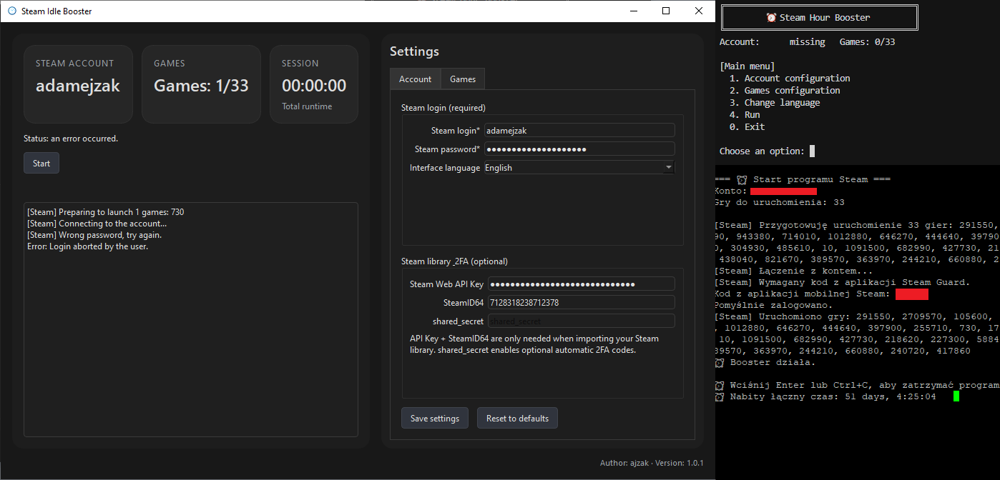

# Steam Idle Booster

<p align="center">
  <strong>Steam Idle Booster</strong> – lightweight CLI + GUI tool for Steam that lets you idle (fake playing) up to <strong>33 games at the same time</strong> to farm playtime and trading cards.<br/>
  <em>PL: Lekka aplikacja CLI + GUI do nabijania godzin w nawet 33 gry jednocześnie i zdobywania kart.</em>
</p>

<p align="center">
  
</p>

> ⚠️ **Security / Bezpieczeństwo:** credentials are stored in plain text in `config.json`.  
> Do not share the app folder with other users (**nie udostępniaj katalogu z aplikacją innym osobom**).

## Features

- **Game idling** – simulates running selected games (up to 33 at once).
- **Two interfaces**:
  - **CLI** – text-based menu for configuring the account and games list,
  - **GUI (PySide6)** – modern dark UI with cards, tabs and logs.
- **Steam account configuration** – login, password, `shared_secret`, Web API key, SteamID64.
- **Steam library import** – fetch games via Steam Web API and pick them from a list/grid.
- **Multi-language UI** – interface available in **Polish (PL), English (EN), German (DE), Spanish (ES), Portuguese (PT) and Russian (RU)**.

## Technologies

- **Language:** Python 3.11+
- **Libraries:** `steam[client]`, `requests`, `PySide6`.

## Screenshots

- GUI main screen – `./docs/screenshot-gui-main.png`
- GUI account settings – `./docs/screenshot-gui-account.png`
- CLI menu with games list – `./docs/screenshot-cli-menu.png`

*(Replace paths and file names with the actual ones in your `docs/` folder.)*

## Example usage

Minimal examples from the project directory:

- **CLI:**

  ```bash
  python main.py
  ```

- **Windows GUI (.exe):**

  Download the latest `SteamIdleBooster-win.exe` from [Releases](https://github.com/adamejzak/steam-idle-booster/releases/),  
  place it in its own folder and run it by double-clicking. *(PL: najlepiej w osobnym katalogu, bo obok tworzy `config.json` i `.steam_credentials`.)*

More usage examples and detailed flows are available in the Wiki.

## 📚 Documentation / Dokumentacja

Full documentation (installation, configuration, FAQ) is available in the **GitHub Wiki** (both **PL** and **EN**):

- [Open project Wiki](https://github.com/adamejzak/steam-idle-booster/wiki)

## License

There is currently no explicit license file in this repository.  
It is recommended to add a `LICENSE` file (e.g. MIT, Apache-2.0) and update this section accordingly.

## Author / Contact

- Author: **ajzak**
- GitHub: `https://github.com/adamejzak/steam-idle-booster`
- For bugs and feature requests, please use the **Issues** tab in the repository. 
